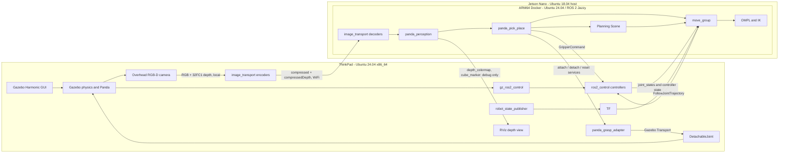

# Architecture

## Three-Host Topology (Current)

Simulation no longer runs on the dev ThinkPad. The diagram and network
contract below still describe the correct logical placement of each
component; only the physical machine labeled "ThinkPad" has moved:

| Role | Hostname | Notes |
| --- | --- | --- |
| Dev machine | `user-ThinkPad-T440p` (WiFi only) | Development, git, and SSH-based orchestration of the other two hosts. Runs no ROS 2 nodes itself except a local `ros2 bag record` during a pick-and-place run. |
| Simulation host | `thinkpadt440sserver` (SSH alias; both wired and WiFi active) | Everything labeled "ThinkPad" in the diagram below: Gazebo (headless, no GUI/RViz), `gz_ros2_control`, controllers, camera encoders, `panda_grasp_adapter`. |
| Planner | `jetson` (SSH alias, Docker) | Unchanged: `panda_perception`, `move_group`, `panda_pick_place`. |

The simulation host is dual-homed (WiFi kept on for normal desktop use), so
Cyclone DDS is pinned to the wired interface via
`infra/thinkpadt440sserver/env.sh` (`CYCLONEDDS_URI` pointing at
`/etc/panda-demo/cyclonedds.xml`) to prevent multicast discovery from
stalling. Orchestration scripts (`scripts/launch_simulation.sh`,
`scripts/launch_planner.sh`, `scripts/run_pick_place.sh`) drive the
simulation host over SSH (`SERVER_SSH_HOST`, default `thinkpadt440sserver`)
the same way they already drove the Jetson (`JETSON_SSH_HOST`).

## Runtime Placement

Perception (`panda_perception`) runs on the Jetson, co-located with planning,
not on the ThinkPad. See
[ADR-0001](adr/0001-perception-placement.md) for why, and the "Real Hardware
Deployment" section below for what changes (nothing, for this node) once the
simulated camera is replaced by a physical one wired into the Jetson.

## Network Contract

- `ROS_DOMAIN_ID=42`
- `RMW_IMPLEMENTATION=rmw_cyclonedds_cpp`
- `ROS_AUTOMATIC_DISCOVERY_RANGE=SUBNET`
- Docker `--network host`; no `--privileged`
- Normal multicast discovery; no addresses are hard-coded in runtime config

Important cross-host interfaces:

| Interface | Direction | Purpose |
| --- | --- | --- |
| `/joint_states` | ThinkPad to Jetson | Current Panda arm and finger state |
| `/tf`, `/tf_static` | ThinkPad to Jetson | Robot transforms |
| `/overhead_camera/image/compressed` | ThinkPad to Jetson | Compressed RGB feed for the co-located estimator |
| `/overhead_camera/depth_image/compressedDepth` | ThinkPad to Jetson | Compressed depth feed for the co-located estimator |
| `/panda_arm_controller/follow_joint_trajectory` | Jetson to ThinkPad | Planned arm trajectory |
| `/panda_hand_controller/gripper_cmd` | Jetson to ThinkPad | Open/close command |
| `/grasp/attach` | Jetson to ThinkPad | Attach cube in Gazebo |
| `/grasp/detach` | Jetson to ThinkPad | Release cube in Gazebo |
| `/grasp/reset_object` | Jetson to ThinkPad | Reset detached cube for repeat runs |
| `/perception/depth_colormap`, `/perception/cube_marker` | Jetson to ThinkPad | RViz debug view only, not used for planning |

`/perception/cube_pose` no longer crosses the network: the estimator and the
pick-and-place state machine that consumes it both run on the Jetson. The only
image data that crosses hosts is the compressed camera feed, and only because
Gazebo's rendering needs a GUI-capable machine. In a real deployment the
camera plugs directly into the Jetson (see below), so this hop, and the
compression it requires, disappears entirely; it is a simulation artifact, not
a property of the target architecture. RViz still consumes the debug-only
`/perception/depth_colormap` and `/perception/cube_marker` topics from the
Jetson, which is why they are listed as a (low-priority, non-blocking)
cross-host dependency.

## RGB-D Pose Estimation

The estimator segments the blue cube in HSV space, cleans the mask with
morphology, erodes the accepted contour to avoid edge pixels, and computes the
median valid depth. A median-absolute-deviation limit rejects noisy surfaces.
Camera intrinsics project the centroid into 3D and TF transforms it from
`overhead_camera_optical_frame` to `world`. A seven-sample temporal median
filters the final position; implausible workspace coordinates and stale RGB /
depth pairs are rejected. No Gazebo entity-pose topic or service is subscribed.

The node itself (`cube_pose_estimator.cpp`) only knows about the plain
`/overhead_camera/*` topics; it has no idea whether they came from Gazebo, a
real driver, or a decompressor. Placement and compression are handled entirely
in launch files, not in the node.

## Planning And Grasping

The Jetson node owns the state machine and MoveIt Planning Scene. Recovery
first detaches, opens, optionally resets, and moves HOME so the camera cannot
remain occluded after an interrupted run. It then waits for a fresh RGB-D pose,
adds the measured cube as a collision object, and derives approach and grasp
targets from that frozen measurement. It removes the world cube during final
approach and creates an attached collision object after the ThinkPad confirms
the Gazebo attachment. At PLACE it detaches in both Gazebo and MoveIt and adds
the cube back to the world Planning Scene.

The DetachableJoint abstracts only grasp contact. Every arm movement is planned
through MoveIt/OMPL on the Jetson and executed by the ThinkPad's
`JointTrajectoryController`.

## Real Hardware Deployment

This repository targets simulation today; the notes below describe the
prepared but hardware-unvalidated path to a real Panda plus a real overhead
camera wired directly into the Jetson.

- A camera driver node (model TBD) only needs to publish `sensor_msgs/Image`
  (or `image_transport` compressed equivalents) on `/overhead_camera/image`,
  `/overhead_camera/depth_image`, and `/overhead_camera/camera_info`, with the
  same frame conventions used today. `panda_perception` requires no code
  changes; it already runs on the Jetson and is sensor-agnostic.
- Because the camera would be local to the Jetson, the `image_transport`
  encode/decode hop across WiFi disappears; the driver publishes directly to
  the topics the estimator subscribes to.
- The ThinkPad's role shrinks to `ros2_control` plus whatever physical
  controller box drives the real arm, or it is removed once Gazebo is no
  longer needed.
- This path has not been run against real hardware. Treat it as a documented
  migration target, not a tested feature.

## Source Ownership

This repository is the source of truth. `scripts/sync_to_jetson.sh` uses rsync
to create a documented build context on the Jetson. The Dockerfile then builds
only the Jetson packages into `panda-planner:jazzy`; there are no manual source
copies or ROS packages installed on the Jetson host.

